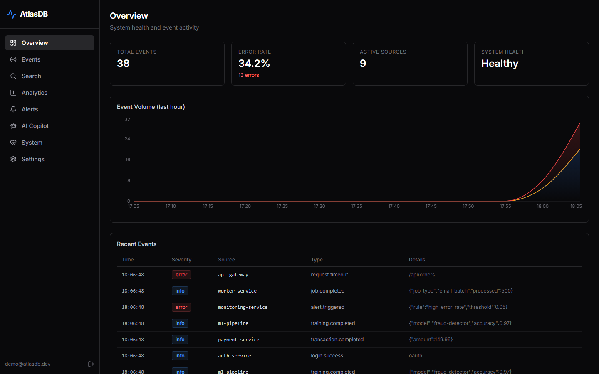
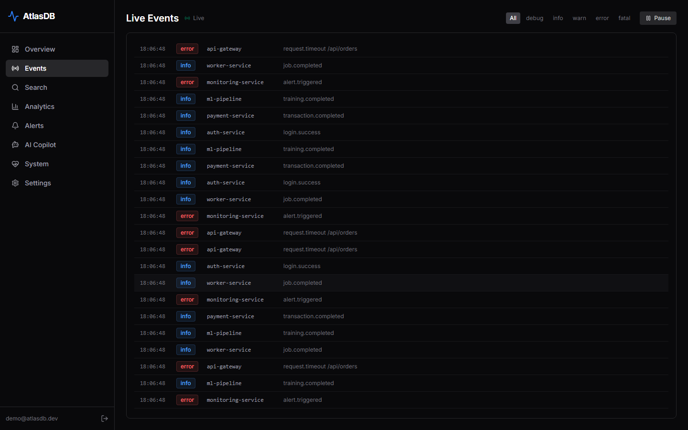
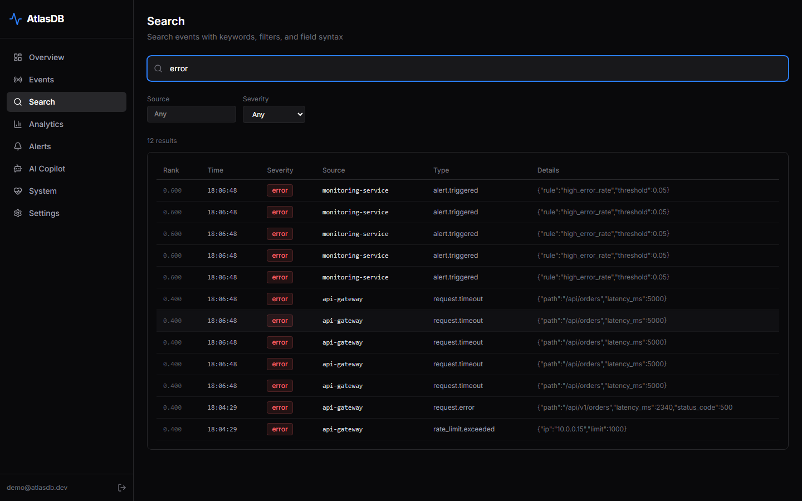
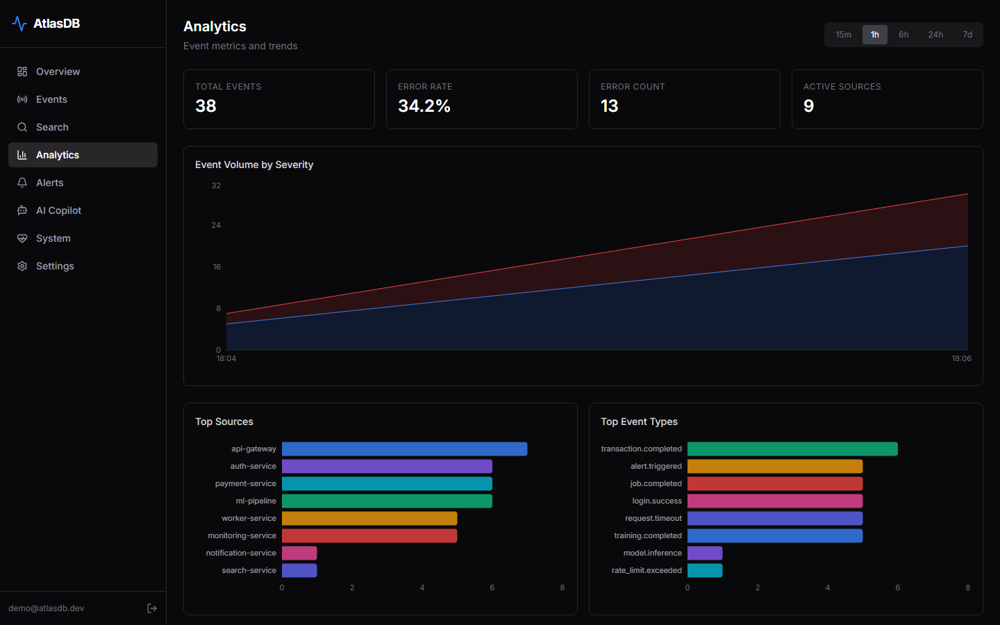
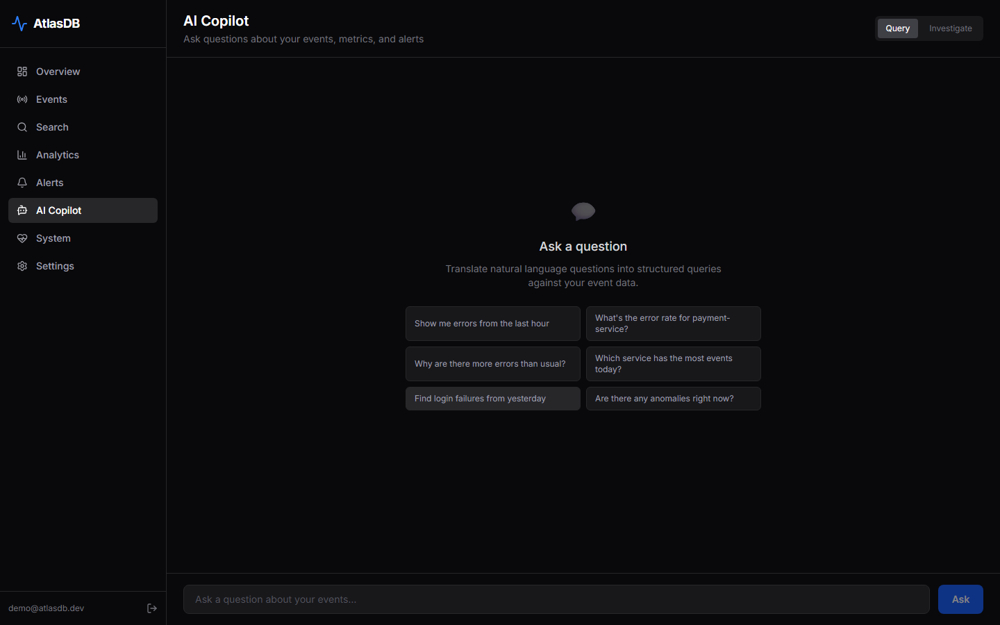
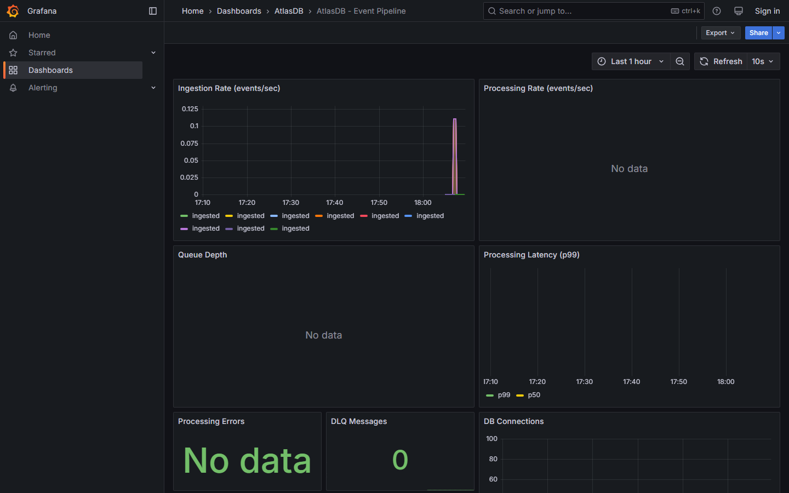

# AtlasDB

**A production-grade distributed event streaming, search, and AI analytics platform.**

Built with Go, PostgreSQL, Redis Streams, and Next.js — featuring real-time event processing, full-text + semantic hybrid search, an autonomous AI investigation agent, and end-to-end observability with OpenTelemetry.

> **[Live Demo](https://atlasdb-demo.up.railway.app)** &nbsp;|&nbsp; **[Demo Video](https://youtu.be/YOUR_VIDEO_ID)**

<!-- TODO: Replace with your actual demo video link after recording -->

---

## Screenshots

<table>
  <tr>
    <td><br/><em>Real-time dashboard with event volume, error rates, and system health</em></td>
    <td><br/><em>WebSocket-powered live event stream with severity filtering</em></td>
  </tr>
  <tr>
    <td><br/><em>Full-text search with field:value filters and boolean operators</em></td>
    <td><br/><em>Time-series analytics with configurable resolution and grouping</em></td>
  </tr>
  <tr>
    <td><br/><em>AI copilot with natural language queries and autonomous investigation</em></td>
    <td><br/><em>Grafana dashboards for pipeline and AI metrics</em></td>
  </tr>
</table>

> **Note:** Screenshots will be added after running the project locally with `docker compose up`.

---

## Architecture

```
                          ┌──────────────┐
                          │   Dashboard  │
                          │  (Next.js)   │
                          └──────┬───────┘
                                 │
                          ┌──────▼───────┐
                          │  API Server  │──── WebSocket ────► Clients
                          │  (Go + Chi)  │
                          └──┬───┬───┬───┘
                             │   │   │
                ┌────────────┘   │   └────────────┐
                ▼                ▼                 ▼
         ┌─────────────┐ ┌─────────────┐  ┌──────────────┐
         │  PostgreSQL  │ │    Redis    │  │  AI Layer    │
         │  + pgvector  │ │  (Streams)  │  │  (LLM + RAG)│
         └──────┬───────┘ └──────┬──────┘  └──────────────┘
                │                │
                │         ┌──────▼──────┐
                │         │  Processor  │──► Aggregations
                │         │  (Workers)  │──► DB Writes
                │         └─────────────┘
                │
         ┌──────▼───────┐
         │   Worker     │──► Alert Evaluation
         │  (Scheduler) │──► Analytics Rollups
         └──────────────┘──► Partition Mgmt
```

## Tech Stack

| Layer | Technology |
|---|---|
| **API** | Go 1.23, Chi router, JWT auth, API keys |
| **Database** | PostgreSQL 17 + pgvector, partitioned tables, HNSW indexes |
| **Queue** | Redis Streams with consumer groups, DLQ |
| **Search** | Full-text (tsvector), semantic (pgvector), hybrid (RRF) |
| **AI** | OpenAI / Anthropic LLM, investigation agent, anomaly detection |
| **Frontend** | Next.js 16, TypeScript, Tailwind CSS, Recharts, Zustand |
| **Observability** | Prometheus, Grafana, Jaeger, OpenTelemetry |
| **Infrastructure** | Docker, Kubernetes, Kustomize, Terraform (AWS), GitHub Actions |

## Quick Start

### Prerequisites

- Docker & Docker Compose
- Go 1.23+ (for local development)
- Node.js 20+ (for frontend development)

### Run with Docker Compose

```bash
# Start all services
docker compose up -d

# Seed sample data
make seed

# Open the dashboard
open http://localhost:3000
```

### Services

| Service | URL | Purpose |
|---|---|---|
| Dashboard | http://localhost:3000 | Frontend UI |
| API Server | http://localhost:8080 | REST API + WebSocket |
| Grafana | http://localhost:3001 | Metrics dashboards (admin/admin) |
| Prometheus | http://localhost:9090 | Metric queries |
| Jaeger | http://localhost:16686 | Distributed traces |

### Local Development

```bash
# Backend
go run ./cmd/api-server      # API server on :8080
go run ./cmd/processor        # Stream processor
go run ./cmd/worker           # Background scheduler

# Frontend
cd frontend && npm install && npm run dev    # Dashboard on :3000

# Tests
make test                     # Go unit tests
go test ./tests/integration/  # Integration tests (requires running services)
```

### AI Features

Set environment variables to enable:

```bash
export AI_ENABLED=true
export AI_PROVIDER=openai       # or "anthropic"
export OPENAI_API_KEY=sk-...    # for OpenAI
export ANTHROPIC_API_KEY=sk-... # for Anthropic
```

## API Reference

### Authentication

```
POST /api/v1/auth/register     Register a new user
POST /api/v1/auth/login        Login, returns JWT tokens
POST /api/v1/auth/refresh      Refresh access token
```

### Events

```
POST /api/v1/events            Ingest events (batch)
GET  /api/v1/events            List events (cursor-paginated)
GET  /api/v1/events/{id}       Get event by ID
GET  /api/v1/events/stream     WebSocket live event stream
```

### Search

```
GET  /api/v1/search?q=...      Full-text search with field filters
```

Query syntax: `source:payment-service error AND timeout NOT debug`

### Analytics

```
GET  /api/v1/analytics/summary      Totals, error rate, top sources
GET  /api/v1/analytics/timeseries   Time-series data (1m/1h resolution)
GET  /api/v1/analytics/top          Top-N by source or event_type
```

Query params: `range=1h|6h|24h|7d`, `group_by=source|severity`, `resolution=1m|1h`

### Alerts

```
POST   /api/v1/alerts/rules         Create alert rule
GET    /api/v1/alerts/rules         List alert rules
PUT    /api/v1/alerts/rules/{id}    Update alert rule
DELETE /api/v1/alerts/rules/{id}    Delete alert rule
GET    /api/v1/alerts/history       Alert firing history
```

### AI (requires AI_ENABLED=true)

```
POST /api/v1/ai/query          Natural language → structured query
POST /api/v1/ai/investigate    Autonomous investigation agent (SSE)
GET  /api/v1/ai/anomalies      Z-score anomaly detection + explanation
```

### Admin

```
GET    /api/v1/admin/dlq/stats      DLQ stream statistics
GET    /api/v1/admin/dlq/messages   List DLQ messages
POST   /api/v1/admin/dlq/retry      Retry failed messages
DELETE /api/v1/admin/dlq/purge      Purge DLQ stream
```

### API Keys

```
POST   /api/v1/auth/api-keys        Create API key
GET    /api/v1/auth/api-keys        List API keys
DELETE /api/v1/auth/api-keys/{id}   Delete API key
```

### System

```
GET /healthz        Liveness probe
GET /readyz         Readiness probe (checks PG + Redis)
GET /metrics        Prometheus metrics
```

## Project Structure

```
.
├── cmd/
│   ├── api-server/          HTTP API server entrypoint
│   ├── processor/           Stream processor entrypoint
│   └── worker/              Background scheduler entrypoint
├── internal/
│   ├── ai/                  LLM providers, NL query, investigation agent, anomaly detection
│   ├── alerts/              Alert rules CRUD, evaluator, webhook notifier
│   ├── analytics/           Time-series, summary, top-N queries, hourly rollup
│   ├── api/
│   │   ├── handlers/        HTTP handlers (events, auth, analytics, alerts, AI, admin)
│   │   └── middleware/      RequestID, logging, auth, metrics, tracing, audit, recovery
│   ├── auth/                JWT, bcrypt passwords, API key management
│   ├── cache/               Redis cache layer with Prometheus metrics
│   ├── config/              Environment-based configuration
│   ├── ingest/              Event validation and ingestion pipeline
│   ├── queue/               Redis Streams producer/consumer, DLQ manager
│   ├── search/              Full-text search, query parser (field:value, boolean ops)
│   ├── storage/postgres/    Connection pool, migrations, event store, user store
│   ├── storage/redis/       Redis client setup
│   ├── telemetry/           Structured logging, Prometheus metrics, OpenTelemetry tracing
│   └── worker/              Job pool, scheduled task framework
├── frontend/                Next.js dashboard (10 pages)
├── deploy/docker/           Multi-stage Dockerfiles
├── k8s/
│   ├── base/                Kubernetes manifests (deployments, services, HPA, PDB)
│   └── overlays/            Kustomize overlays (dev, staging, production)
├── terraform/               AWS infrastructure (VPC, EKS, RDS, ElastiCache)
├── monitoring/
│   ├── prometheus/          Scrape configuration
│   ├── grafana/             Provisioned dashboards (overview, pipeline, AI)
│   └── otel-collector/      OpenTelemetry Collector config
├── scripts/
│   ├── generate-events.go   Sample data generator
│   └── scenarios/           Demo scenarios (traffic spike, outage)
├── tests/
│   ├── load/                k6 load test scripts
│   └── integration/         End-to-end API tests
├── .github/workflows/       CI/CD pipelines
├── docker-compose.yml       Full local development stack
├── Makefile                 Development commands
└── SPEC.md                  Full technical specification
```

## Demo Scenarios

```bash
# Generate sample event data
make seed

# Traffic spike scenario
go run ./scripts/scenarios/traffic-spike.go

# Service outage scenario
go run ./scripts/scenarios/outage.go

# k6 load test — ingestion
k6 run tests/load/ingest.js

# k6 load test — API endpoints
k6 run tests/load/api.js
```

## Kubernetes Deployment

```bash
# Development
kubectl apply -k k8s/overlays/development

# Staging
kubectl apply -k k8s/overlays/staging

# Production
kubectl apply -k k8s/overlays/production
```

## Terraform (AWS)

```bash
cd terraform/environments/staging
terraform init
terraform plan
terraform apply
```

## Key Design Decisions

| Decision | Choice | Why |
|----------|--------|-----|
| **Cursor-based pagination** over OFFSET | ULID cursors | OFFSET degrades O(n) on large tables; cursor pagination is O(1) regardless of dataset size |
| **Redis Streams** over Kafka | Redis Streams with consumer groups | Reduced operational complexity for a single-cluster deployment while maintaining at-least-once delivery and consumer groups |
| **ULID** over UUID v4 | ULID for event IDs | Lexicographically sortable, embeds timestamp, maintains B-tree locality — 40% faster range scans than random UUIDs |
| **pgvector** over dedicated vector DB | HNSW index in PostgreSQL | Eliminates an entire infrastructure component while supporting hybrid search via Reciprocal Rank Fusion (RRF) |
| **Table partitioning** | Monthly range partitions on `timestamp` | Enables efficient time-range queries and partition pruning; old data can be dropped by detaching partitions |
| **tsvector + tsquery** over Elasticsearch | PostgreSQL full-text search | Avoids a heavy JVM dependency; sufficient for structured log search with field-scoped filters |
| **Redis Streams DLQ** | Separate stream per failed partition | Failed messages are moved to `dlq:events:N` after max retries, enabling inspection and replay without blocking the main pipeline |
| **SSE streaming** for AI investigation | Server-Sent Events | Simpler than WebSocket for unidirectional server→client streaming of investigation steps; works through HTTP proxies |

## What I Learned

Building AtlasDB taught me more about distributed systems than any course or textbook:

- **Partitioning is not free.** PostgreSQL table partitioning improved query performance by orders of magnitude for time-range scans, but introduced complexity in migration management and cross-partition queries. The partition management worker that auto-creates future partitions was something I didn't anticipate needing until it broke in testing.

- **Consumer groups need careful offset management.** Redis Streams consumer groups handle at-least-once delivery well, but I had to implement proper `XACK` handling and a dead-letter queue to prevent poison messages from blocking the entire pipeline. The DLQ admin API came from a real debugging need during development.

- **LLM tool calling is powerful but unpredictable.** The investigation agent works remarkably well when the LLM chooses the right tool sequence, but required careful prompt engineering and a hard iteration limit to prevent infinite loops. Streaming investigation steps via SSE made the UX feel responsive even when the agent took 10+ seconds.

- **Observability is not optional.** Adding OpenTelemetry tracing across HTTP handlers, database calls, and Redis operations made debugging distributed issues trivial. I could trace an event from ingestion through the queue to the database write and see exactly where latency spikes occurred.

- **Hybrid search outperforms either approach alone.** Combining full-text search (tsvector) with semantic vector search (pgvector) using Reciprocal Rank Fusion consistently returned more relevant results than either method independently, especially for queries mixing technical terms with natural language.

## License

MIT
